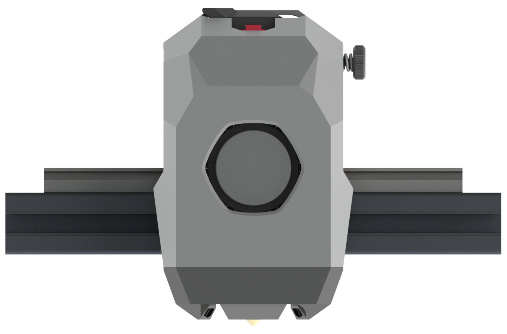

<h1 align="center">FZburner MK2</h1>

**
个人设计的一款3D打印头
**

[A burner for 3D parinter]

<h1 align="center"> >>>>>>>>80%>>>>>====

🟩🟩🟩🟩🟩🟩🟩🟩⬜⬜

 
 ---
 
 ### 主要功能
> - [x] 近程挤出 默认HGX挤出机 / 可选用[**Sherpa Mini挤出机**](https://github.com/Annex-Engineering/Sherpa_Mini-Extruder)
> - [x] Dragon 热端 / Bambu 热端
> - [x] 3010 热端风扇
> - [x] 5015 物料风扇
