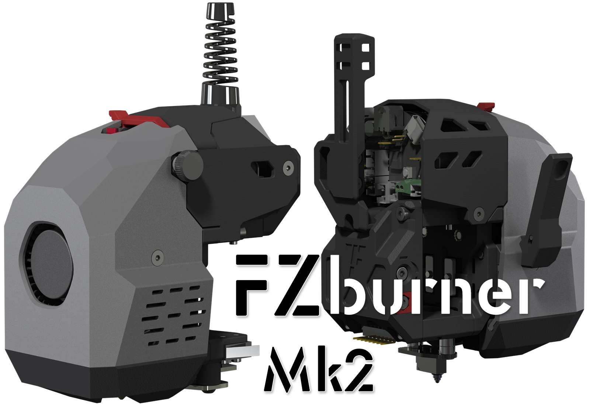
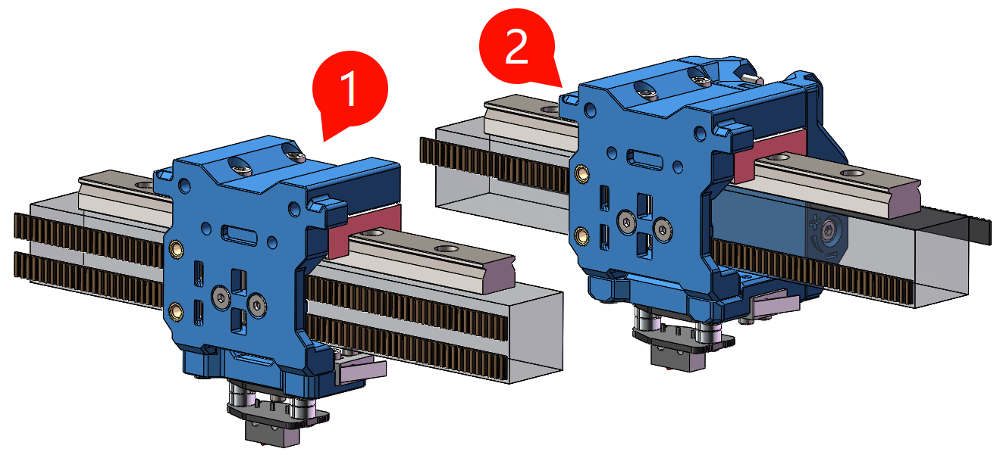
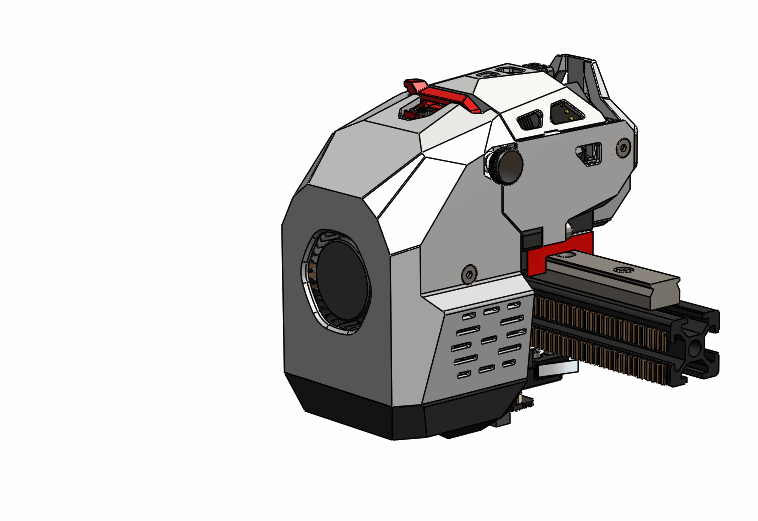
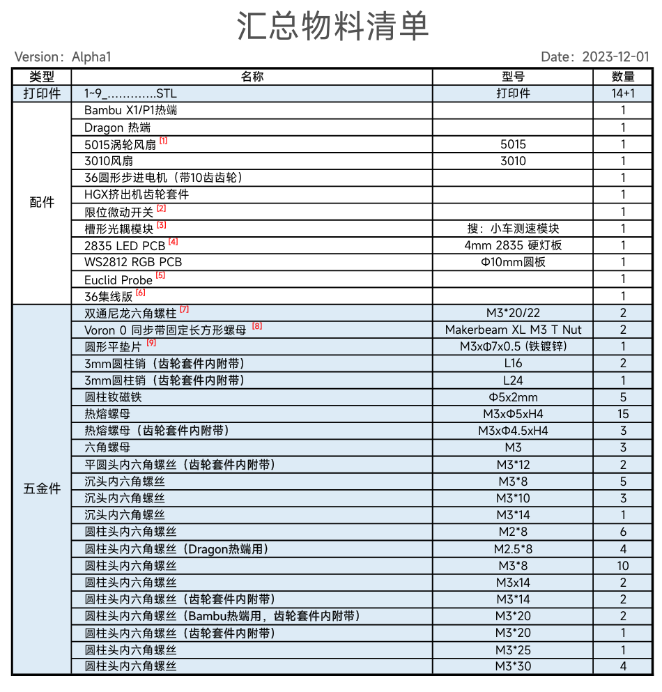
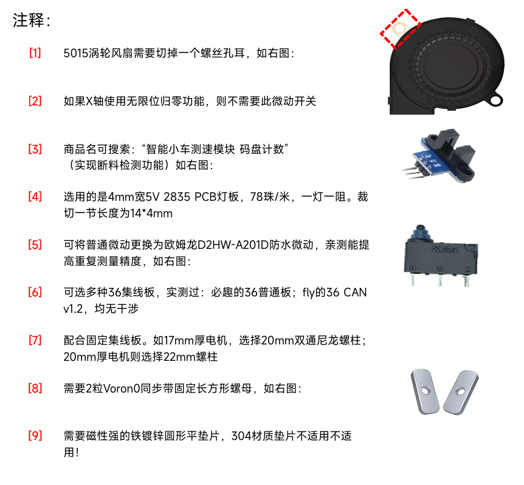
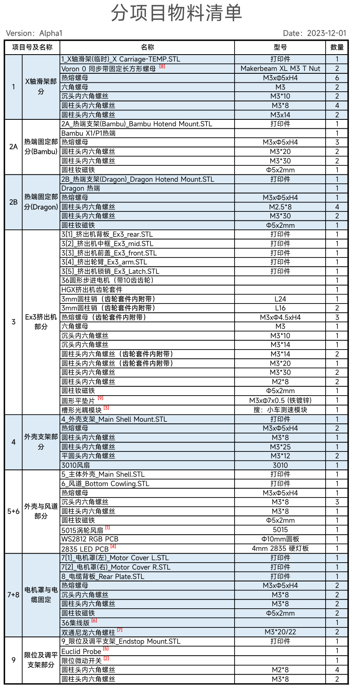

  
     

<h1 align="center">FZburner Mk2</h1>

*
一款个人设计的3D打印头
   
  [A Printhead for 3D parinter]
*

**

**
**<h3 align="center"> RC候选版本已上传，欢迎试用 </h3>**
*
反馈意见可以通过[📺BiliBili](https://space.bilibili.com/1898517)私信
*

 ---
 

 ---

## 目录

- [兼容机型](#兼容机型)
- [目前进度](#目前进度)
- [功能特色](#功能特色)
- [打印提醒](#打印提醒)
- [BOM表](#BOM表)
  - [汇总清单](#汇总清单)
  - [注释](#注释)
  - [分项目清单](#分项目清单)

---

### 兼容机型

适用的打印机X轴布局为：**2020铝型材  +  顶置MGN12导轨（MGN12H滑块） +  6mm 2GT同步带（2种Core XY绕线方式）**

支持的2种Core XY绕线方式： **① [Voron0式]  或者  ② [BLV式]**

> **[Voron0式]①** 代表机型
> - Dayu CC

> **[BLV式]②** 代表机型
> - BLV mgn Cube **（同步带换向）**
> - V-Core 3.1 **（换用6mm同步带）**
> - VzBot **（换用MGN12导轨）**

 

### 目前进度 

> - [ ] ♾ STL打印文件（RC版）------- 0%
> - [ ] ♾ BOM表 -----------------------     0%
> - [x] ✅ 可编辑文件 -------------------     100%
> - [ ]  ♾ 安装说明 ---------------------     10%

  

### 功能特色

> - 近程挤出  **- [HGX挤出机齿轮套件、集成断料检测]**
> - Dragon 热端 / Bambu 热端
> - 3010 热端风扇
> - 5015 物料风扇
> - 支持的调平方式  **-** [**Euclid Probe**](https://github.com/nionio6915/Euclid_Probe)
> - 耗材切刀
>  
> 

 

### 打印提醒
打印件的设计以0.4mm喷嘴为参考，多数厚度是其整数倍，所以推荐使用0.4mm喷嘴获得预期的打印效果。此外各悬空处设计有自带支撑，STL文件优化过摆放方向，直接拖入切片软件切片即可。

***推荐切片参数：*** ` 线宽0.4mm，层高0.2mm，轮廓4，顶层4，底层4 `

 

### BOM表
BOM很长，是因为挤出机齿轮套件内含的螺丝也列了进去，而且一些选装件并不是所有人都需要。

> ##### 汇总清单
> 
   
  
>##### 注释
> 
   

>##### 分项目清单
> 
   

