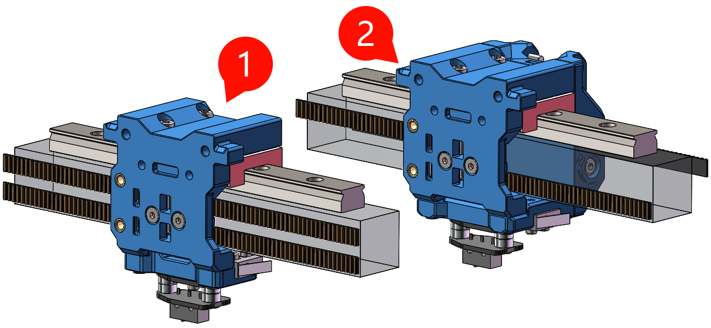

  
     

<h1 align="center">FZburner Mk2</h1>

**

**
**<h3 align="center"> ✨正式版✨ 已上传，欢迎使用 </h3>**
*
反馈意见可以新开一个 [Issues](https://github.com/FZaii/FZburner/issues) 或者 [BiliBili私信](https://space.bilibili.com/1898517)
*

 ---
 

> *正式版 渲染图

---

  

### 适用机型

适用的打印机X轴布局为：**2020铝型材  +  顶置MGN12导轨（MGN12H滑块） +  6mm 2GT同步带（2种Core XY结构）**

支持的2种Core XY结构： **1️⃣ [Voron0式]  或者  2️⃣ [BLV式]**

> **1️⃣[Voron0式]** 代表机型
> - Dayu CC

> **2️⃣[BLV式]** 代表机型
> - BLV mgn Cube **（需同步带换向）**
> - V-Core **（需换6mm同步带）**
> - VzBot **（需换MGN12导轨）**

 

### 功能特色

> - 近程挤出  **- [HGX挤出机齿轮套件、光电断料检测]**
> - Dragon 热端 / Bambu 热端
> - 3010 热端风扇
> - 5015 物料风扇
> - 支持的调平方式  **-** [**Euclid Probe**](https://github.com/nionio6915/Euclid_Probe)  **/** [**Cartographer Probe**](https://docs.cartographer3d.com/)
> - 耗材切刀
>  

